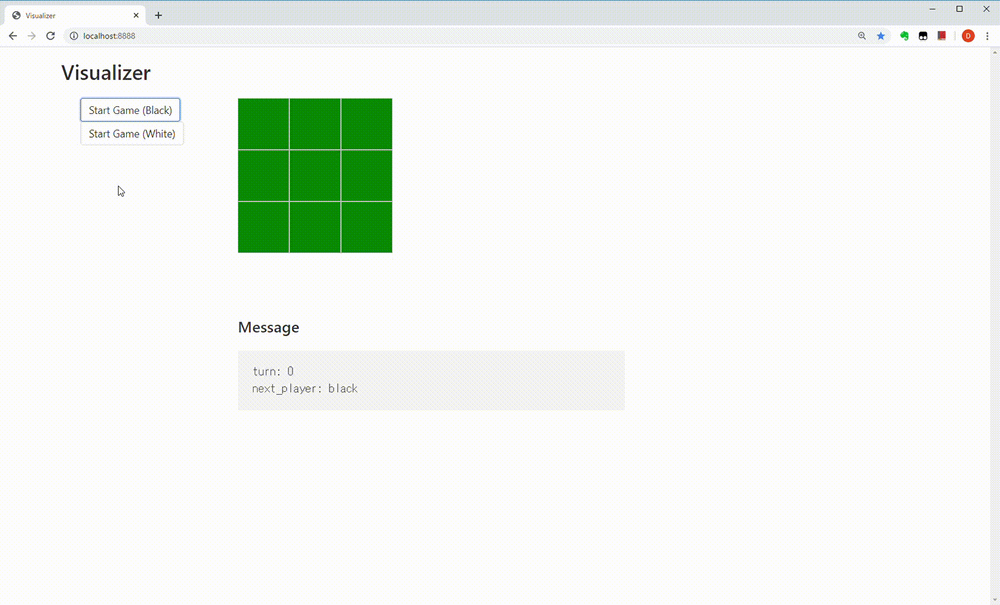

# visualizer-vue-demo

フロントエンドのお勉強用の資料です。

ヴィジュアライザの作りについては、https://github.com/icoxfog417/baby-steps-of-rl-ja のDay2を参考にしました 
  
### requirements


```
Python 3.6.3
tornado==4.5.2
numpy==1.17.0
```

* Vue.jsを使用しています

### how to run

```
# run server
python app.py

# access http://localhost:8888/
```

### demo



### license

* MIT License
